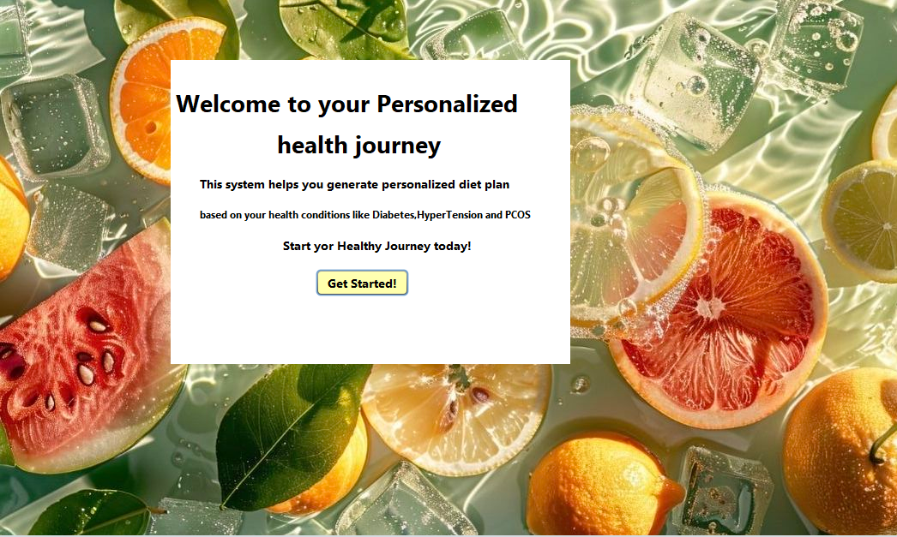
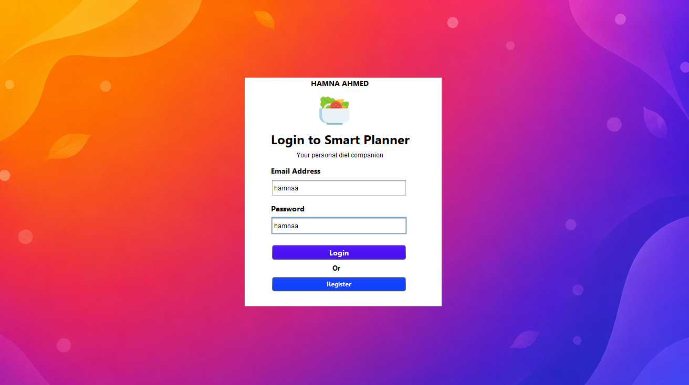
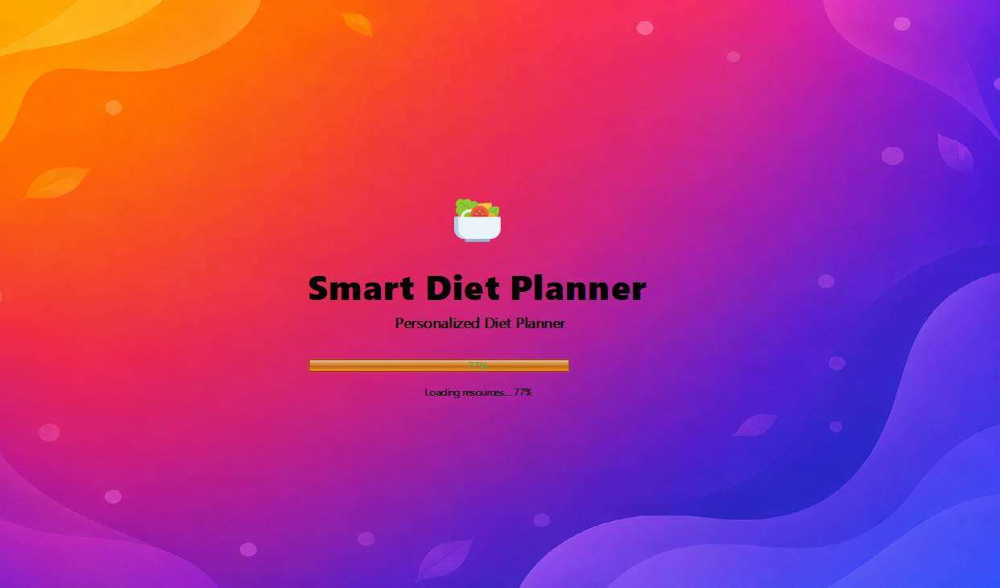
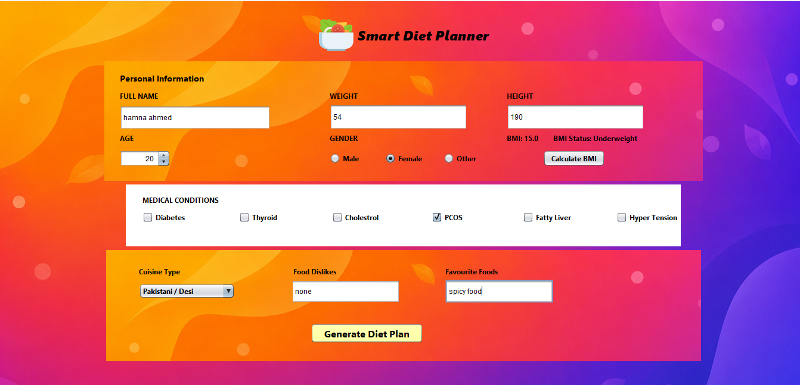
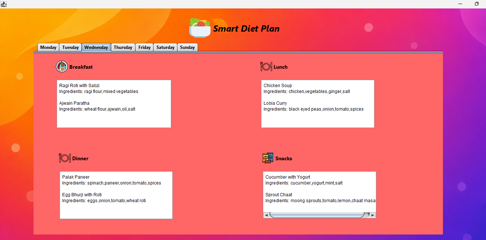

# 🥗 Smart Diet Planner


A Java Swing desktop application that generates personalized weekly diet plans based on user information, health conditions, allergies, and dietary preferences.

---

## 📖 Overview

The Smart Diet Planner helps users create customized weekly meal plans by considering multiple health and dietary factors.

The application provides an interactive graphical interface that makes meal planning simple and user-friendly.

---

## ✨ Features

- ✅ User-friendly Java Swing GUI
- ✅ Login Screen
- ✅ User Information Form
- ✅ Age, Height, Weight Input
- ✅ Health Condition Selection
- ✅ Allergy Selection
- ✅ Diet Preference Selection
- ✅ Weekly Meal Plan
- ✅ Breakfast, Lunch, Dinner and Snacks

---

## 🛠 Technologies Used

- Java
- Java Swing
- Object-Oriented Programming (OOP)
- NetBeans IDE
- File Handling

---

## 📂 Project Structure

```
AI-Diet-Planner
│
├── src/
├── images/
├── screenshots/
├── README.md

```

---
## 📸 Screenshots

### Welcome Screen


### Login Screen


### Splash Screen


### Input Form


### Result Screen



## 🎯 Learning Outcomes

- Java Swing GUI Development
- Object-Oriented Programming
- Event Handling
- User Interface Design
- File Handling
- Healthcare Application Development

---

## 🚀 Future Improvements

- AI-generated meal recommendations
- Nutrition API integration
- PDF report generation
- User authentication
- Database integration
- Mobile application version

---

## 👩‍💻 Author

**Hamna Ahmed**

🎓 Bioinformatics Student

💻 Interested in AI, Java, Bioinformatics, and Automation

⭐ If you like this project, consider giving it a star!
